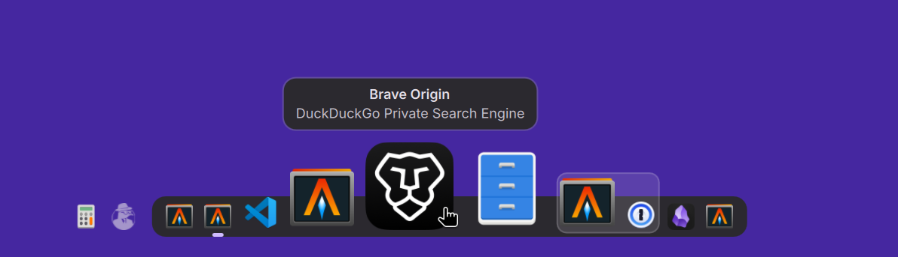

# Marina Dock

A dock for [niri](https://github.com/YaLTeR/niri) that shows your open
windows the way niri arranges them. A plugin for
[DankMaterialShell](https://danklinux.com) (DMS).



## Features

- Icons in niri's column order, with stacked windows on a shared tray and
  floating windows beside the dock
- Magnification of the icon under the pointer
- App name and window title on hover
- Drag icons to reorder columns, stack windows, or tile and float them
- At the screen edge, with optional auto-hide, or in your DMS bar
- Follows your DMS theme and bar style
- Built with performance first: light and smooth, drawing only what's needed

## Requirements

DankMaterialShell 1.6.2 and niri 25.08 or later.

## Install

In DMS, open **Settings → Plugins** and add a registry with the name
`ridumea` and the URL `https://github.com/ridumea/dms-registry.git`.
Then click **Browse**, find **Marina Dock** and install it. **Update All** on
the same page keeps it up to date.

Or clone a release yourself:

```sh
git clone --branch v0.1.0 https://github.com/ridumea/dms-marina-dock.git \
    ~/.config/DankMaterialShell/plugins/MarinaDock
dms ipc call plugin-scan scan
dms ipc call plugins enable marina
```

To update a clone, check out a newer release and run `dms restart`.

Marina Dock appears at the bottom of every screen. If DMS's own Dock is also
on (**Settings → Dock & Launcher → Dock**), turn one of them off. To remove
it, use its delete button in **Settings → Plugins**.

## Usage

- **Click** an icon to switch to its window, **middle-click** to close it,
  **right-click** for the window menu.
- **Scroll** over the dock to step through your windows.
- **Drag** an icon to move its window: between icons for a new column, onto a
  stack or icon to stack it, off the dock to float it, onto the dock to tile
  it.

To put Marina Dock in your bar instead, set **Placement** to **In the bar** and
add the Marina Dock widget in **Settings → Bar → Widgets**, in the centre
section.

## Settings

All in **Settings → Plugins → Marina Dock**:

| Setting | What it does |
|---|---|
| Placement | Screen edge or bar |
| Screen edge | Which edge the dock sits on |
| Distance from the edge | Space between the dock and the edge |
| Auto-hide | Hide the dock until the pointer reaches its edge |
| Show when switching tiled windows | Briefly show a hidden dock when you switch windows |
| Reserve space | Keep tiled windows clear of the dock |
| Current workspace only | Only windows on the current workspace |
| Current screen only | Only windows on the dock's screen |
| Group by app | One icon per app, with a window count |
| Magnification | Grow icons on hover |
| Min icon size | Icon size at rest |
| Max icon size | Size of the icon under the pointer |
| Falloff radius | How many neighbouring icons grow too |
| Enter/exit animation | How quickly icons grow and shrink |

## Reporting a problem

Open an issue describing what happened. For problems with dragging, include
the log from:

```sh
dms ipc call marina debug on
journalctl --user -u dms.service -f | grep "\[marina\]"
dms ipc call marina debug off    # when done
```

## Contributing

See [CONTRIBUTING.md](CONTRIBUTING.md).

## License

MIT, see [LICENSE](LICENSE). Parts are derived from DankMaterialShell's
Running Apps widget; the magnification is inspired by the macOS Dock.
